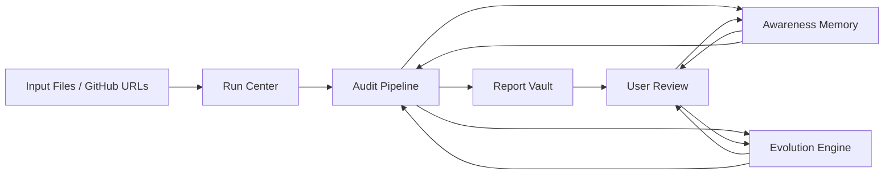

# SolGuard Run, Report, Memory, and Evolution Architecture

## Summary

SolGuard currently behaves like a single-page audit dashboard that streams execution state and then swaps to a report view. That is useful for early iteration, but it does not yet model the product as a durable system.

This spec proposes a four-layer architecture:

1. **Run Center** for live audit execution
2. **Report Vault** for immutable audit reports
3. **Awareness Memory** for durable, queryable audit memory
4. **Evolution Engine** for fully automated but visible self-improvement

The design is intentionally local-first for now, but it separates responsibilities so the storage backend can later move from browser storage to a server database without rewriting the product shape.

## Goals

- Make audit execution visible as a dedicated page rather than only a section inside the dashboard.
- Persist reports so they can be reopened and compared later.
- Turn awareness from a simple summary list into a real memory layer with retrieval and ranking.
- Add an evolution layer inspired by Hermes self-improvement workflows, where traces and feedback generate candidate improvements automatically.
- Keep the system understandable by splitting process, report, memory, and evolution into separate UI surfaces and data contracts.

## Non-Goals

- Do not redesign the underlying Solana audit heuristics in this phase.
- Do not introduce a remote database dependency yet.
- Do not change the current audit pipeline semantics unless required by the new page/data model.
- Do not auto-apply high-risk prompt or rule mutations without an intermediate candidate record.

## Current State

The current codebase already has the following foundations:

- A streamed audit pipeline with phased SSE events
- A results page stored at `/dashboard/reports/[reportId]`
- Local report persistence in browser storage
- A lightweight awareness store derived from each report
- A workflow timeline visualized in the dashboard

The current weakness is that these pieces still behave like one dashboard flow. They are not yet treated as separate product layers with clear contracts between them.

## Reference Model: Hermes Self-Evolution

Hermes self-evolution is relevant because it treats improvement as a separate pipeline:

- execution traces are collected
- traces are evaluated
- candidate improvements are generated
- guardrails validate changes
- the best variant is promoted

The important idea is not "automatically mutate everything". The important idea is **trace-driven improvement with constraint gates**.

SolGuard should mirror that pattern:

- traces from audits feed memory
- memory feeds the next audit
- selected feedback generates evolution candidates
- low-risk changes can be auto-promoted
- higher-risk changes stay visible as candidates

## Proposed Architecture

### 1. Run Center

Purpose:

- Show the live execution of a single audit run.
- Make phases, agents, workflows, and trace items visible in one dedicated page.

Suggested route:

- `/dashboard/runs/[runId]`

Responsibilities:

- Display the live workflow timeline.
- Show phase progression and current agent/workflow.
- Stream trace events from the audit pipeline.
- Keep the input summary visible while the run is active.
- Store a run snapshot for later replay or comparison.

Important rule:

- The Run Center is not the report page.
- It should not try to be the final narrative summary.
- It should focus on "what is happening now" and "what happened during this run".

### 2. Report Vault

Purpose:

- Store a stable audit result.
- Present an immutable report with findings, severity grouping, evidence, and recommendations.

Suggested route:

- `/dashboard/reports/[reportId]`

Responsibilities:

- Display the final audit result.
- Show the execution timeline that produced the report.
- Show the input source summary and model configuration.
- Support comparison against recent reports.
- Keep the report read-only.

Important rule:

- Reports should be treated as immutable snapshots.
- A report can be reopened, but not rewritten in place.

### 3. Awareness Memory

Purpose:

- Preserve durable audit knowledge extracted from reports and feedback.
- Give future audits a ranked recall surface, not just a static archive.

Suggested route:

- `/dashboard/memory`

Responsibilities:

- Show recent memories.
- Show memory categories and recall reasons.
- Track source report links.
- Track confidence, utility, recency, and risk.
- Allow manual inspection of what the system is "remembering".

Awareness should not be a raw summary dump. It should be a structured memory object with the following buckets:

- **Facts**: framework type, entry points, trust boundaries, recurring code structures
- **Risks**: repeated vulnerability patterns, missing validations, dangerous control-flow shapes
- **Feedback**: user-confirmed, user-dismissed, and needs-review outcomes
- **Evolution signals**: improvements that worked or failed

### 4. Evolution Engine

Purpose:

- Convert traces, report outcomes, and feedback into improvement candidates.
- Automatically update low-risk ranking and retrieval behaviors.
- Keep higher-risk changes visible and reviewable.

Suggested route:

- `/dashboard/evolution`

Responsibilities:

- Generate evolution candidates from run traces and feedback.
- Classify candidates by risk level.
- Auto-apply safe changes.
- Keep unsafe changes in a candidate queue.
- Show what changed, why it changed, and what evidence supports it.

Important rule:

- Evolution should be trace-driven and constraint-gated.
- No self-modification should happen without a record.

## Data Model

### Audit Run

An audit run is the live execution object.

Suggested fields:

- `id`
- `createdAt`
- `sourceMode`
- `inputSummary`
- `llm`
- `status`
- `timeline`
- `progress`
- `currentPhase`
- `currentAgent`
- `currentWorkflow`
- `resultId?`

### Audit Report

An audit report is the immutable output of a run.

Suggested fields:

- `id`
- `createdAt`
- `runId`
- `inputSummary`
- `llm`
- `result`
- `timeline`
- `memoryId`
- `evolutionCandidateIds`

### Awareness Entry

An awareness entry is a durable memory item derived from a report or feedback.

Suggested fields:

- `id`
- `reportId`
- `createdAt`
- `title`
- `summary`
- `keySignals`
- `focusAreas`
- `confidence`
- `utility`
- `recency`
- `risk`
- `sourceType`
- `lastRecalledAt?`
- `recallCount`

### Evolution Candidate

An evolution candidate is a proposed improvement to the system.

Suggested fields:

- `id`
- `createdAt`
- `sourceReportId?`
- `sourceMemoryId?`
- `kind`
- `target`
- `before`
- `after`
- `reason`
- `evidence`
- `riskLevel`
- `status`
- `appliedAt?`
- `revertedAt?`

## Data Flow

### Flow Explanation

1. A user starts a run from the dashboard.
2. The Run Center shows live workflow state.
3. The pipeline completes and produces a report snapshot.
4. The report is stored in the Report Vault.
5. A memory entry is derived from the report and stored in Awareness Memory.
6. The system generates evolution candidates from traces and feedback.
7. Low-risk improvements can be auto-promoted.
8. Future runs use awareness and evolution outputs as context.

## UI Plan

### Dashboard Entry

The dashboard should become the launch surface only:

- choose input mode
- configure protocol/provider/model
- start audit

Once the run starts, the user should move to the Run Center.

### Run Page

The run page should emphasize:

- live phase status
- current agent and workflow
- compact event trace
- input source summary
- step-specific metrics

The current `AuditExecutionPanel` is a useful foundation, but it should be promoted into the run page rather than staying embedded in the dashboard.

### Report Page

The report page should emphasize:

- immutable final score
- summary of good and bad signals
- severity grouped findings
- evidence and call chains
- report provenance
- recent report comparisons

### Memory Page

The memory page should emphasize:

- what was remembered
- where it came from
- how often it is recalled
- how useful it has been
- what risk it carries

### Evolution Page

The evolution page should emphasize:

- what changed
- why it changed
- which trace or feedback triggered the change
- whether the change was auto-applied or candidate-only
- whether the change improved later runs

## Awareness Design

The current awareness layer stores a report-derived summary. That is a good start, but it needs to be more explicit about what kind of memory it is.

### Proposed memory scoring dimensions

- **Confidence**: how strongly the report supports the memory
- **Utility**: whether the memory is likely to help future runs
- **Recency**: how recently it was created or recalled
- **Risk**: whether the memory could mislead future analysis
- **Frequency**: how often it has been recalled

### Retrieval behavior

Memory retrieval should rank entries by a weighted score:

- report relevance
- framework similarity
- vulnerability pattern similarity
- recency
- feedback outcomes

### Memory lifecycle

- **Promote**: a memory has been repeatedly useful
- **Keep**: a memory is useful but still ordinary
- **Demote**: a memory has been misleading or stale
- **Expire**: a memory is too old or too noisy

## Evolution Design

The evolution engine should be fully automated but guarded.

### Candidate sources

- execution traces
- report outcomes
- user feedback
- repeated memory recall patterns
- failed or dismissed findings

### Candidate kinds

- prompt section update
- summary template update
- retrieval weight update
- phase routing update
- memory ranking update
- heuristic ordering update

### Guardrails

- auto-apply only low-risk changes
- keep high-risk changes in a visible queue
- require regression checks before promotion
- keep rollback history for every applied candidate

### Promotion policy

The first version should only auto-promote changes that affect:

- memory ranking
- retrieval ordering
- summary phrasing
- evidence grouping

The first version should not auto-promote changes that affect:

- core vulnerability severity rules
- parser behavior
- audit claim thresholds

## Error Handling

### Run failures

- The run page should preserve the latest trace.
- The report page should only appear when a valid report is stored.
- If report persistence fails, the user should still see the result in the current session with a recovery hint.

### Memory failures

- Memory write failures should not block the audit result.
- The UI should show that the report saved but memory sync did not.
- Memory retrieval should degrade gracefully when local storage is unavailable.

### Evolution failures

- Candidate generation failures should not block the report.
- Failed candidates should be visible in the evolution page.
- Auto-promotion should fail closed.

## Testing Strategy

### Unit tests

- report serialization and retrieval
- awareness ranking and memory generation
- evolution candidate generation
- severity grouping and report filtering

### Integration tests

- audit run produces a run snapshot
- completed run writes a report and memory entry
- run page transitions to report page
- report page loads stored report correctly
- memory page renders recent entries

### UI tests

- dashboard start flow
- run page live timeline visibility
- report page immutability and readability
- memory page ranking and fallback states
- evolution page candidate visibility

## Implementation Phases

### Phase 1

- Add a dedicated run page
- Split dashboard launch UI from run UI
- Keep the current report page
- Make report persistence explicit

### Phase 2

- Expand awareness into a ranked memory store
- Add memory page UI
- Add retrieval metrics and memory lifecycle tracking

### Phase 3

- Add evolution candidates
- Record trace-driven candidate generation
- Add evolution page UI

### Phase 4

- Connect memory and evolution into next-run context
- Add low-risk auto-promotion
- Add visible rollback history

## Risks

- LocalStorage may be limiting for large histories.
- Too much automatic evolution could drift the product if guardrails are weak.
- Report and memory data may diverge if the persistence contract is not kept atomic.
- The run/report distinction may feel like extra navigation if the run page is not clearly different from the report page.

## Acceptance Criteria

- A run has its own dedicated page.
- A completed audit writes a report snapshot and a memory entry.
- The report can be reopened independently from the live run.
- Awareness is queryable and ranked, not just stored.
- Evolution candidates are generated automatically from traces and feedback.
- Low-risk improvements can be auto-applied.
- High-risk improvements remain visible and reviewable.

